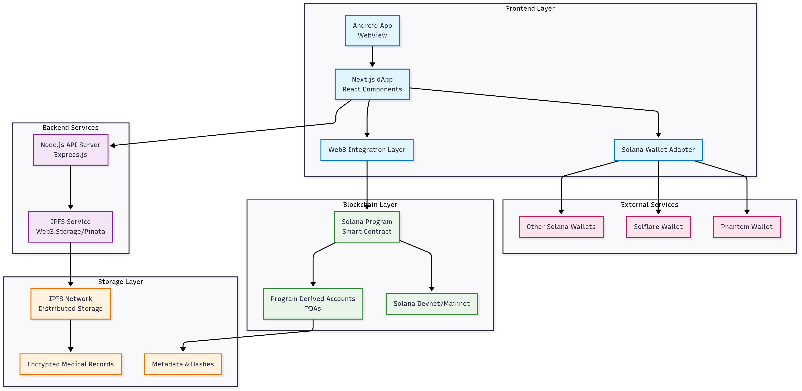

# 🏥 HealthChain – Blockchain-Based Health Data Access System (Solana + IPFS)

HealthChain is a decentralized healthcare data platform built using the Solana blockchain. It enables patients to **own**, **control**, and **securely share** their medical records with hospitals, labs, and doctors – all without relying on a centralized authority.

---

## 🚀 Features

- 🔐 Patient-controlled data access using **Solana PDAs**
- 📦 Medical records stored securely on **IPFS**
- 🏥 Role-based access (Patients, Doctors, Labs, Hospitals)
- 🧾 Transparent access logs
- 📱 Simple mobile interface (Android WebView + Next.js frontend)
- ⛓️ Smart contracts written in **Rust (Anchor framework)**

---

## 🧱 Architecture




## 🛠️ Tech Stack

| Layer              | Tech                                                                 |
|--------------------|----------------------------------------------------------------------|
| ⚙️ Smart Contracts  | Solana + Rust + Anchor                                               |
| 🌐 Frontend         | Next.js + Tailwind CSS                                               |
| 📱 Mobile Wrapper   | Android WebView                                                      |
| 📁 File Storage     | IPFS (via web3.storage or Pinata)                                    |
| 🔐 Identity & Auth  | Solana Wallets (Phantom/Solana Mobile Stack)                         |

---

## 📦 Installation (Developer Setup)

> Prerequisites:  
> - [Node.js](https://nodejs.org/)  
> - [Anchor](https://book.anchor-lang.com/)  
> - [Solana CLI](https://docs.solana.com/cli/install-solana-cli)  
> - [Rust](https://www.rust-lang.org/tools/install)  

```bash
# Clone the repo
git clone https://github.com/your-username/healthchain.git
cd healthchain

# Install dependencies
yarn install

# Build smart contracts
anchor build

# Run local validator
solana-test-validator

# Test your contract
anchor test


